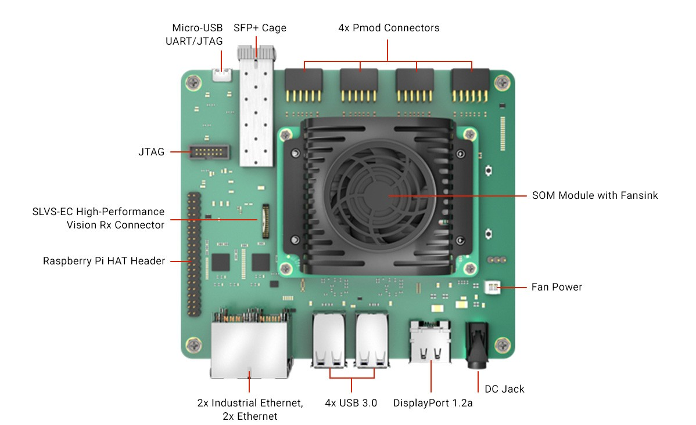

# **KRIA:tm: KR260 - "The right engine for the right task" tutorial series**

## **Description**

This repository contains tutorials on getting started with the KRIA:tm: KR260 development kit for Robotic applications. This includes building a FPGA platform with offload engines for specific tasks. The tutorials is structured in the following way -

1. [AMD Kria:tm: adaptable Robotics I – The right engine for the right task.](docs/Adaptable_Robotics_I.md)
2. [AMD Kria:tm: adaptable Robotics II – Unifying the communication protocol.](docs/Adaptable_Robotics_II.md)
3. [~~AMD Kria:tm: adaptable Robotics III – Isolation, separation and APU realtime~~](docs/Adaptable_Robotics_III.md) - *In planning...*
4. [~~AMD Kria:tm: adaptable Robotics IV – The awakening - adding camera, lidar and sensor~~](docs/Adaptable_Robotics_IV.md)- *In planning...*
5. [~~AMD Kria:tm: adaptable Robotics VI – Simulation – hardware in the loop with KR260~~](docs/Adaptable_Robotics_VI.md)- *In planning...*

## **Introduction**

This repository contains tutorials on getting started with the KRIA:tm: KR260 development kit for Robotic applications. This includes building a FPGA platform with offload engines for specific tasks. The concept of the tutorial series is to ease the onboarding and to give a starting point for further development. The tutorials will give an introduction to the following topics -

1. Building a FPGA platform with offload engines for specific tasks using the makefile flow and containers.
2. Configuring and running software on the different parts of the system.
3. Adding communication protocol.
4. Using the Kria:tm: KR260 development kit to interface with sensors.
5. Using the hardware in the loop simulation.

### **Platform Overview**

Each of the chapters, stipulated above, builds on each other. Following these tutorials the user shall learn how to build a FPGA platform, configure and run software on the different parts of the system, and add a communication stack. The tutorials will also cover how to use the Kria:tm: KR260 development kit to interface with a sensor, and how to use the hardware in the loop simulation tool for simulation.

Please start with the "AMD Kria:tm: adaptable Robotics I – The right engine for the right task." chapter which takes you through the hardware build, setup and configuration before jumping to chapter # 2, "AMD Kria:tm: adaptable Robotics II – Unifying the communication protocol.".

The following is a conceptual picture of the Kria:tm: K26 System On Module(SOM) with the added FPGA logic. Items depicted in purple is added and used in this tutorial.

*Figure # 1 - Conceptual picture of Kria:tm: K26 System On Module(SOM) with the added FPGA logic. Items depicted in purple is added and used in this tutorial.*

 
 

Functionality reached from tutorial #1 can be seen in the video below.

<video width="640" height="480" controls autoplay loop muted>
  <source src="docs/images/2024-10-11.mp4" type="video/mp4">
</video>

https://media.gitenterprise.xilinx.com/user/485/files/ca020668-2ee6-4787-a8dd-4cca1c9bb18a

Functionality reached from tutorial #2 can be seen in the video below.

<video width="640" height="480" controls autoplay loop muted>
  <source src="docs/images/MicroROSonMicroBlaze2.mp4" type="video/mp4">
</video>

https://media.gitenterprise.xilinx.com/user/485/files/43e6a2fb-55dc-41bc-b37f-d4db5c47f335

 
 

Kria:tm: KR260 board used in this tutorial.

