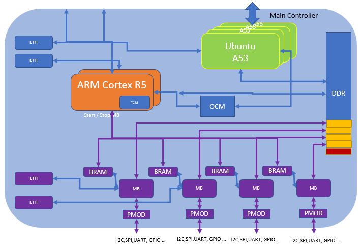
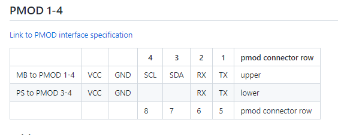
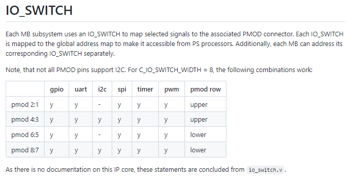
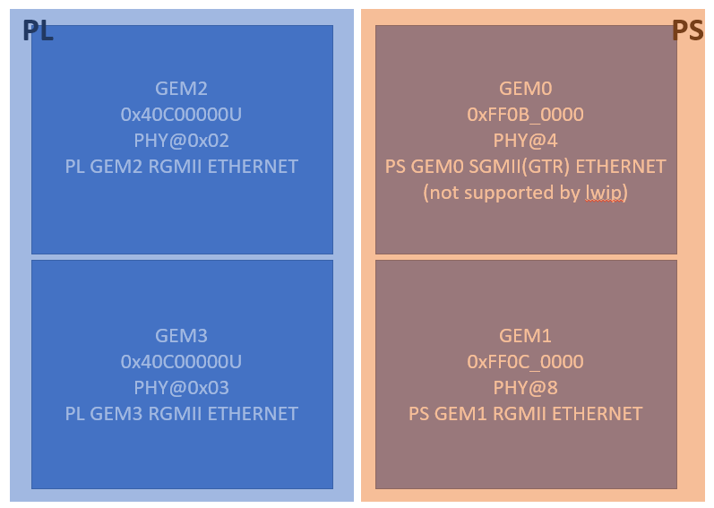
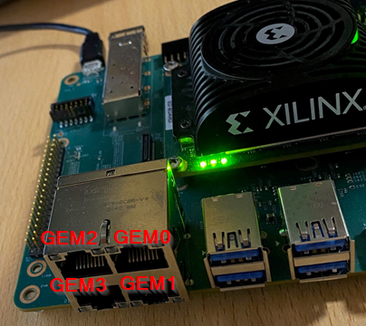
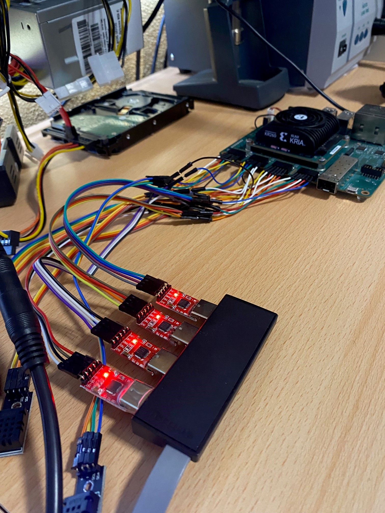

# **AMD Kria:tm: adaptable Robotics I   – The right engine for the right task.**


## **Description**

In this first chapter we will build an FPGA image with four(4) MicroBlaze softcore CPU's. These CPU's will run completely independent from the rest of the system and each other, and executables will be loaded through remoteproc protocol to the independent CPUs from Ubuntu.


### **Platform Overview**

Following this tutorial, you should be able to put together a system containing the following -

* Ubuntu running on the A53 cluster

* MicroBlaze soft CPU's, running on demand in the FPGA fabric

* MicroBlaze controlled from Ubuntu via RemoteProc (start/stop/load)

* ARM Cortex R5's free to use


Whats needed for this Tutorial.

* Kria KR260 development kit
* Four(4) USBtoTTL connector - At least one to get started
* Ethernet connected to board - use GEM0 (see picture below)
* License for the TEMAC block in the FPGA
    *  https://www.xilinx.com/products/intellectual-property/temac.html


<br>


**IMPORTANT: The "Tri-Mode Ethernet Media Access Controller (TEMAC)" needs a license. For more information and evaluation, more information can be found here - https://www.xilinx.com/products/intellectual-property/temac.html**


<br>
<br>

Here is an overview of the internal design blocks used in this tutorial.




*Figure # 1 - Conceptual picture of Kria K26 System On Module(SOM) with the added FPGA logic. Items depicted in purple is added and used in this tutorial.*


Here you can see the functionality reached from this tutorial.


https://media.gitenterprise.xilinx.com/user/485/files/33b57d68-7900-41a2-a7be-56f5539a6426


### **Flash OS image**


In this tutorial we will use Ubuntu 22.04 LTS.

Follow the instructions here to flash Ubuntu 22.04.  <br>
 [Getting Started with KRIA KR260 Robotics Starter Kit](https://www.xilinx.com/products/som/kria/kr260-robotics-starter-kit/kr260-getting-started/getting-started.html) <br>

Once you have flashed Ubuntu the next step is to update the boot firmware.

*Note - On first boot of Ubuntu, you will be asked to change the password.*

Follow the instructions here to update the boot firmware. "Boot FW management via xmutil" <br>
https://xilinx-wiki.atlassian.net/wiki/spaces/A/pages/1641152513/Kria+SOMs+Starter+Kits#Boot-FW-Update-Process


### **Build hardware platform**

Clone the hardware platform and build for the xlnx_rel_v2022.1 branch.

```
git clone --recursive -b xlnx_rel_v2022.1 https://github.com/Xilinx/kria-vitis-platforms
```


Setup the AMD Vitis 2022.1 SDK build tools. (Change the path to where you have installed the Vitis 2022.1 tools)

```
source <path>/Vitis/2022.1/settings64.sh
```


Build the platform.

```
cd kria-vitis-platforms/kr260
make platform PFM=kr260_4mb_4pmod
```

The above step will create the fpga bitstream(.bit) and a fpga bitstream binary file(.bin). We will use the tool "xmutil" to load the binary to the FPGA fabric from Ubuntu. More on "xmutil" here - https://github.com/Xilinx/xmutil


When finished building, locate the kr260_4mb_4pmod_wrapper.bin that was created and copy the *.bin file to the board running Ubuntu. I.e. username@(board ip). I.e.

```
scp kr260_4mb_4pmod_wrapper.bin ubuntu@192.168.2.155:/tmp
```

*Note - The design includes the Tri-Mode Ethernet Media Access Controller (TEMAC) and it requires a license. Without this license the design will not build. See link above to get an evaluation license.

### **Modify device tree image**

To prepare for OpenAMP's remoteproc applications, we will need to reserve some memory and inform Ubuntu about the MicroBlaze BRAM controllers. MicroBlaze BRAM controller is used to hold the MicroBlaze boot vector executable software. Furthermore, MicroBlaze is the soft CPU in the FPGA, and BRAM is the local memory for the CPU.


Do the following to extract the devicetree from Ubuntu.

To do this, we find the fit image, extract the right devicetree, modify it and create a new devicetree to override the existing one.

<details>
  <summary>Modify the devicetree with the following -> Click to expand!</summary>

Find the following node and insert the following code below this node.

        reserved-memory {
                #address-cells = <0x02>;
                #size-cells = <0x02>;
                ranges;
    
                pmu@7ff00000 {
                        reg = <0x00 0x7ff00000 0x00 0x100000>;
                        no-map;
                        phandle = <0x7a>;
                };
---Insert code start---                
```
                ddr_memory_proc_zero:   mproc0@20000000 {
                        no-map;
                        reg = <0x00 0x20000000 0x00 0x2000000>;
                };

                ddr_memory_proc_one: mproc1@22000000 {
                        no-map;
                        reg = <0x00 0x22000000 0x00 0x2000000>;
                };

                ddr_memory_proc_two:  mproc2@24000000 {
                        no-map;
                        reg = <0x00 0x24000000 0x00 0x2000000>;
                };

                ddr_memory_proc_three: mproc3@26000000 {
                        no-map;
                        reg = <0x00 0x26000000 0x00 0x2000000>;
                };
```
---Insert code end---   
 &emsp;&emsp; };        


Compile the devicetree after making the above changes and call the file "user-override.dtb" and put the file in /boot/firmware directory.

```
root@kria:/boot/firmware# dtc -I dts -O dtb fdt-smk-k26-revA-sck-kr-g-revB.dts -o user-override.dtb
```

</details>


<details>
  <summary>Here is how to modifiy the devicetree -> Click to expand!</summary>


## **Modifying FIT image**


Here are the steps -

On the target running Ubuntu do the following:

```
sudo su
cd /boot/firmware
```


Dump images from the fit image:

dumpimage -l `<image>`.fit


```
root@kria:/boot/firmware# dumpimage -l image.fit
FIT description: Simple image with single Linux kernel, ramdisk and FDT blob
Created:         Thu Mar  2 07:05:14 2023
 Image 0 (kernel-1)
  Description:  Ubuntu kernel
  Created:      Thu Mar  2 07:05:14 2023
  Type:         Kernel Image
  Compression:  gzip compressed
  Data Size:    19130648 Bytes = 18682.27 KiB = 18.24 MiB
  Architecture: AArch64
  OS:           Linux
  Load Address: 0x00200000
  Entry Point:  0x00200000
  Hash algo:    sha1
  Hash value:   c05e4e61dc48c8e10ba5df242e377caabcf5fe23
 Image 1 (ramdisk-1)
  Description:  Ubuntu ramdisk
  Created:      Thu Mar  2 07:05:14 2023
  Type:         RAMDisk Image
  Compression:  uncompressed
  Data Size:    55205822 Bytes = 53911.94 KiB = 52.65 MiB
  Architecture: AArch64
  OS:           Linux
  Load Address: unavailable
  Entry Point:  unavailable
  Hash algo:    sha1
  Hash value:   d8e3aec7d391b2f09e0f9acb1c8c959b7b1192c1
 Image 2 (fdt-zynqmp-smk-k26-revA.dtb)
  Description:  Flattened device tree blob - zynqmp-smk-k26-revA
  Created:      Thu Mar  2 07:05:14 2023
  Type:         Flat Device Tree
  Compression:  uncompressed
  Data Size:    38330 Bytes = 37.43 KiB = 0.04 MiB
  Architecture: AArch64
  Load Address: 0x44000000
  Hash algo:    sha1
  Hash value:   25e542b74f5d5851a9c5d13e3ec25766a4793971
 Image 3 (fdt-smk-k26-revA-sck-kr-g-revA.dtb)
  Description:  Flattened device tree blob - smk-k26-revA-sck-kr-g-revA
  Created:      Thu Mar  2 07:05:14 2023
  Type:         Flat Device Tree
  Compression:  uncompressed
  Data Size:    43258 Bytes = 42.24 KiB = 0.04 MiB
  Architecture: AArch64
  Load Address: 0x44000000
  Hash algo:    sha1
  Hash value:   8dc8e120b68b61e89790464278376f3243cf80c0
 Image 4 (fdt-smk-k26-revA-sck-kv-g-revA.dtb)
  Description:  Flattened device tree blob - smk-k26-revA-sck-kv-g-revA
  Created:      Thu Mar  2 07:05:14 2023
  Type:         Flat Device Tree
  Compression:  uncompressed
  Data Size:    42568 Bytes = 41.57 KiB = 0.04 MiB
  Architecture: AArch64
  Load Address: 0x44000000
  Hash algo:    sha1
  Hash value:   e318d1b34ecf5a0700e7246b351d983eff46689c
 Image 5 (fdt-smk-k26-revA-sck-kr-g-revB.dtb)
  Description:  Flattened device tree blob - smk-k26-revA-sck-kr-g-revB
  Created:      Thu Mar  2 07:05:14 2023
  Type:         Flat Device Tree
  Compression:  uncompressed
  Data Size:    43234 Bytes = 42.22 KiB = 0.04 MiB
  Architecture: AArch64
  Load Address: 0x44000000
  Hash algo:    sha1
  Hash value:   14153e2eb63c6eee59306997bd7ad60a4609883f
 Image 6 (fdt-smk-k26-revA-sck-kv-g-revB.dtb)
  Description:  Flattened device tree blob - smk-k26-revA-sck-kv-g-revB
  Created:      Thu Mar  2 07:05:14 2023
  Type:         Flat Device Tree
  Compression:  uncompressed
  Data Size:    42368 Bytes = 41.38 KiB = 0.04 MiB
  Architecture: AArch64
  Load Address: 0x44000000
  Hash algo:    sha1
  Hash value:   dc7d080caf288ddc8e242bd653c80af5dd9d8d31
 Default Configuration: 'conf-zynqmp-smk-k26-revA'
 Configuration 0 (conf-zynqmp-smk-k26-revA)
  Description:  Boot Ubuntu on kria SOM
  Kernel:       kernel-1
  Init Ramdisk: ramdisk-1
  FDT:          fdt-zynqmp-smk-k26-revA.dtb
  Hash algo:    sha1
  Hash value:   unavailable
 Configuration 1 (conf-smk-k26-revA-sck-kr-g-revA)
  Description:  Boot Ubuntu on kria SOM
  Kernel:       kernel-1
  Init Ramdisk: ramdisk-1
  FDT:          fdt-smk-k26-revA-sck-kr-g-revA.dtb
  Hash algo:    sha1
  Hash value:   unavailable
 Configuration 2 (conf-smk-k26-revA-sck-kv-g-revA)
  Description:  Boot Ubuntu on kria SOM
  Kernel:       kernel-1
  Init Ramdisk: ramdisk-1
  FDT:          fdt-smk-k26-revA-sck-kv-g-revA.dtb
  Hash algo:    sha1
  Hash value:   unavailable
 Configuration 3 (conf-smk-k26-revA-sck-kr-g-revB)
  Description:  Boot Ubuntu on kria SOM
  Kernel:       kernel-1
  Init Ramdisk: ramdisk-1
  FDT:          fdt-smk-k26-revA-sck-kr-g-revB.dtb
  Hash algo:    sha1
  Hash value:   unavailable
 Configuration 4 (conf-smk-k26-revA-sck-kv-g-revB)
  Description:  Boot Ubuntu on kria SOM
  Kernel:       kernel-1
  Init Ramdisk: ramdisk-1
  FDT:          fdt-smk-k26-revA-sck-kv-g-revB.dtb
  Hash algo:    sha1
  Hash value:   unavailable
root@kria:/boot/firmware#

```


Extract the default devicetree used for Ubuntu.

We find the devicetree used from the bootlogs:

```
Hit any key to stop autoboot:  0
model=SMK-K26-XCL2G-ED

Device 0: Vendor: Generic  Rev: 1.98 Prod: Ultra HS-COMBO
            Type: Removable Hard Disk
            Capacity: 121909.5 MB = 119.0 GB (249670656 x 512)
... is now current device
Scanning usb 0:1...
Found U-Boot script /boot.scr.uimg
6234 bytes read in 1 ms (5.9 MiB/s)
## Executing script at 20000000
Selecting DT for Kria boards
Kria DT: #conf-smk-k26-revA-sck-kr-g-revB
Configuring the cma value based on the board type
cma=1000M

```


Kria DT: #**conf-smk-k26-revA-sck-kr-g-revB**

The *conf-smk-k26-revA-sck-kr-g-revB* is in configuration #3 from the fit image. Within configuration number 3, the devicetree used is "fdt-smk-k26-revA-sck-kr-g-revB.dtb". We then find the devicetree binary file, which is image # 5, in the fit image and extract it.


We extract it the following way:

dumpimage -T flat_dt -p <?>  devicetree.dtb -o temp/system.dtb

```
root@kria:/boot/firmware# dumpimage -T flat_dt -p 5 image.fit -o fdt-smk-k26-revA-sck-kr-g-revB.dtb
Extracted:
 Image 5 (fdt-smk-k26-revA-sck-kr-g-revB.dtb)
  Description:  Flattened device tree blob - smk-k26-revA-sck-kr-g-revB
  Created:      Thu Mar  2 07:05:14 2023
  Type:         Flat Device Tree
  Compression:  uncompressed
  Data Size:    43234 Bytes = 42.22 KiB = 0.04 MiB
  Architecture: AArch64
  Load Address: 0x44000000
  Hash algo:    sha1
  Hash value:   14153e2eb63c6eee59306997bd7ad60a4609883f
```


We decompress the devicetree binary *fdt-smk-k26-revA-sck-kr-g-revB.dtb*:

```
root@kria:/boot/firmware# dtc -I dtb -O dts fdt-smk-k26-revA-sck-kr-g-revB.dtb -o fdt-smk-k26-revA-sck-kr-g-revB.dts -@
```


Now we add the nodes described earlier in "Modify the devicetree with the following" and generate the devicetree binary file again.


To make it a bit easier to edit the devicetree file, we login to our board from the host. (On the board do "ifconfig" to find your IP address )"

```
ssh ubuntu@192.168.2.137
The authenticity of host '192.168.2.137 (192.168.2.137)' can't be established.
ED25519 key fingerprint is SHA256:Km7MF3TsdgnPgyhw9wUC6WR7pAF00UM52NzgPuuDnGY.
This key is not known by any other names
Are you sure you want to continue connecting (yes/no/[fingerprint])? yes
Warning: Permanently added '192.168.2.137' (ED25519) to the list of known hosts.
ubuntu@192.168.2.137's password:
Welcome to Ubuntu 22.04.2 LTS (GNU/Linux 5.15.0-1020-xilinx-zynqmp aarch64)

 * Documentation:  https://help.ubuntu.com
 * Management:     https://landscape.canonical.com
 * Support:        https://ubuntu.com/advantage

  System information as of Tue Jun 27 09:37:15 UTC 2023

  System load:              0.08740234375
  Usage of /:               6.2% of 116.10GB
  Memory usage:             16%
  Swap usage:               0%
  Processes:                240
  Users logged in:          1
  IPv4 address for docker0: 172.17.0.1
  IPv4 address for eth1:    192.168.2.137
  IPv6 address for eth1:    fd95:7f2f:c450:1:30c7:6ebd:e96e:aae8


 * Introducing Expanded Security Maintenance for Applications.
   Receive updates to over 25,000 software packages with your
   Ubuntu Pro subscription. Free for personal use.

     https://ubuntu.com/pro

Expanded Security Maintenance for Applications is not enabled.

234 updates can be applied immediately.
157 of these updates are standard security updates.
To see these additional updates run: apt list --upgradable

11 additional security updates can be applied with ESM Apps.
Learn more about enabling ESM Apps service at https://ubuntu.com/esm

Last login: Tue Jun 27 08:47:22 2023
ubuntu@kria:~$ cd /boot/firmware
```
Become root and edit the devicetree file.

```
sudo su
vi fdt-smk-k26-revA-sck-kr-g-revB.dts
```

Compile the devicetree after making the above changes and call the file "user-override.dtb" and put the file in /boot/firmware directory.

```
root@kria:/boot/firmware# dtc -I dts -O dtb fdt-smk-k26-revA-sck-kr-g-revB.dts -o user-override.dtb -@
```


On the next reboot, Ubuntu will look for and load any "user-override.dtb" files in the /boot/firmware folder.

</details>


## **Build XMUTIL overlay files**

Clone the Linux device tree generator to somewhere on your computer
```
git clone -b xlnx_rel_v2023.1 https://github.com/Xilinx/device-tree-xlnx
```

Make a directory called "overlay" and create the following files. I.e.
```
cd ros-dds-microblaze/KR260/examples/MB/Adaptable_Robotics_I
mkdir overlay
cd overlay
```

Find the vivado project *.xsa file and copy it to the current directory. I.e.

```
cp <path>/kria-vitis-platforms/kr260/platforms/xilinx_kr260_4mb_4pmod_202210_1/hw/kr260_4mb_4pmod.xsa .
```
Create the following **xsct.ini** file in the overlay directory.

```
#
# Modify the path to the device-tree-xlnx
#
hsi open_hw_design kr260_4mb_4pmod.xsa;
hsi set_repo_path /home/tomast/git/device-tree-xlnx;
hsi create_sw_design device-tree -os device_tree -proc psu_cortexa53_0;
hsi set_property CONFIG.dt_overlay true [hsi::get_os];
hsi generate_target -dir overlay;
hsi close_hw_design [hsi::current_hw_design];
```
Modify the path in the script "/home/tomast/git/device-tree-xlnx;" to the path of your device-tree-xlnx installation.

run the xsct.ini file with the tool XSCT. Make sure Vitis environment is sourced.

```
xsct xsct.ini
```

Open the overlay/pl.dtsi file and add the following code. I.e.

```
vi overlay/pl.dtsi
```
Add the code in between the **"--- add code start ---"** and **"--- add code end ---"** tags. Do not include the tags in the file.

<details>
<summary>Overlay modifications -> Click to expand!</summary>


```
/*
 * CAUTION: This file is automatically generated by Xilinx.
 * Version: XSCT 2022.1
 * Today is: Thu Jul 18 11:49:58 2024
 */


/dts-v1/;
/plugin/;

--- add code start --- 

&{/} {

ipi_amp: ipi@ff340000 {
                compatible = "ipi_uio";
                reg = <0x0 0xff340000 0x0 0x1000>;
                interrupt-parent = <&gic>;
                interrupts = <0 29 4>;
};


mb_rproc0 {
        compatible = "xlnx,mb_remoteproc";
        #address-cells = <0x2>;
        #size-cells = <0x2>;
        ranges;
        reg = <0x0 0x90000000 0x0 0x10000>;
        reset-gpio = <&gpio 82 0>;
        sleep-gpio = <&gpio 78 0>;
        power-gpio = <&gpio 100 0>;
        memory-region = <&ddr_memory_proc_zero>;
        bram = <&mb_subsystem_0_microblaze_0_local_memory_axi_bram_ctrl_0>;
    };

mb_rproc1 {
        compatible = "xlnx,mb_remoteproc";
        #address-cells = <0x2>;
        #size-cells = <0x2>;
        ranges;
        reg = <0x0 0x90000000 0x0 0x10000>;
        reset-gpio = <&gpio 84 0>;
        sleep-gpio = <&gpio 80 0>;
        power-gpio = <&gpio 172 0>;
        memory-region = <&ddr_memory_proc_one>;
        bram = <&mb_subsystem_1_microblaze_0_local_memory_axi_bram_ctrl_0>;
    };

mb_rproc2 {
        compatible = "xlnx,mb_remoteproc";
        #address-cells = <0x2>;
        #size-cells = <0x2>;
        ranges;
        reg = <0x0 0x90000000 0x0 0x10000>;
        reset-gpio = <&gpio 86 0>;
        sleep-gpio = <&gpio 90 0>;
        power-gpio = <&gpio 171 0>;
        memory-region = <&ddr_memory_proc_two>;
        bram = <&iop_pmod_3_lmb_0_mb_bram_ctrl>;
    };

mb_rproc3 {
        compatible = "xlnx,mb_remoteproc";
        #address-cells = <0x2>;
        #size-cells = <0x2>;
        ranges;
        reg = <0x0 0x90000000 0x0 0x10000>;
        reset-gpio = <&gpio 88 0>;
        sleep-gpio = <&gpio 92 0>;
        power-gpio = <&gpio 170 0>;
        memory-region = <&ddr_memory_proc_three>;
        bram = <&iop_pmod_4_lmb_0_mb_bram_ctrl>;
    };

};

--- add code end --- 

Then find the following nodes and add the following tag to the nodes.

gpio: gpio@ff0a0000 {

gic: interrupt-controller@f9010000 {        


```

</details>

Save the file and then compile the new pl.dtsi file to a pl.dtbo file.

```
dtc -@ -O dtb -o pl.dtbo overlay/pl.dtsi
```
The above command should result in a new file called "pl.dtbo" in the current directory.

Create a new directory on the board(KR260) called **"kr260_4mb_4pmod"** at the following location **"/lib/firmware/xilinx"**, the result will be (/lib/firmware/xilinx/kr260_4mb_4pmod). Then copy the pl.dtbo file to the directory and rename it to **kr260_4mb_4pmod.dtbo**.


```
scp pl.dtbo ubuntu@<ip_address>:/tmp
```
On the board, copy the file to the /lib/firmware/xilinx/kr260_4mb_4pmod/kr260_4mb_4pmod.dtbo directory.I.e.

```
cp /tmp/pl.dtbo /lib/firmware/xilinx/kr260_4mb_4pmod/kr260_4mb_4pmod.dtbo
```
Note - If the directory does not exist, create it.


In the same directory, create a file called "shell.json" and add the following code.

```
{
    "shell_type" : "XRT_FLAT",
    "num_slots": "1"
}
```

Last but not least, copy the vivado project *.bin file to the /lib/firmware/xilinx/kr260_4mb_4pmod directory and rename it. I.e.

```
scp kr260_4mb_4pmod_wrapper.bin ubuntu@<ip_address>:/tmp
cp /tmp/kr260_4mb_4pmod_wrapper.bin /lib/firmware/xilinx/kr260_4mb_4pmod/kr260_4mb_4pmod.bin
```

At the end you should have the following files in the **/lib/firmware/xilinx/kr260_4mb_4pmod** directory, all with the same name, execpt the shell.json file.

```
root@kria:/lib/firmware/xilinx/kr260_4mb_4pmod# ls -l
total 6512
-rw-r--r-- 1 root root 6649268 Jul 22 13:06 kr260_4mb_4pmod.bin
-rw-r--r-- 1 root root   10932 Jul 22 13:06 kr260_4mb_4pmod.dtbo
-rw-r--r-- 1 root root      56 Jul 22 10:02 shell.json
root@kria:/lib/firmware/xilinx/kr260_4mb_4pmod#

```

*Note: All the files in the /lib/firmware/xilinx/kr260_4mb_4pmod directory should be owned by root and have the same name.*


Execute the following command, on the board as root, to list the apps available. This should then display the new app "kr260_4mb_4pmod".

```
xmutil listapps

```

```
root@kria:/lib/firmware/xilinx/kr260_4mb_4pmod# xmutil listapps
                     Accelerator          Accel_type                            Base           Base_type      #slots(PL+AIE)         Active_slot

                        axi_bram            XRT_FLAT                        axi_bram            XRT_FLAT               (0+0)                  -1
                k26-starter-kits            XRT_FLAT                k26-starter-kits            XRT_FLAT               (0+0)                  -1
                 kr260_4mb_4pmod            XRT_FLAT                 kr260_4mb_4pmod            XRT_FLAT               (0+0)                  0,
root@kria:/lib/firmware/xilinx/kr260_4mb_4pmod#
```


## **Build MicroBlaze Linux driver**


Build the Linux kernel driver on the target board (KR260).


### **Building the kernel module.**


Here is the kernel driver. Create a directory in the root folder and copy the code to a file called "mb_remoteproc.c" and "Makefile" respectively.


<details>
    <summary> Expand for kernel driver code </summary>


```
#include <linux/module.h>
#include <linux/kernel.h>
#include <linux/init.h>
#include <linux/of_platform.h>
#include <linux/of_address.h>
#include <linux/platform_device.h>
#include <linux/remoteproc.h>
#include <linux/of_reserved_mem.h>
#include <linux/of_gpio.h>
#include <linux/delay.h>
#include <linux/gpio/consumer.h>

#include <linux/dma-mapping.h>
/*#include "remoteproc_internal.h"*/

int rproc_elf_load_rsc_table(struct rproc *rproc, const struct firmware *fw);
int rproc_elf_load_segments(struct rproc *rproc, const struct firmware *fw);
struct resource_table *rproc_elf_find_loaded_rsc_table(struct rproc *rproc, const struct firmware *fw);
int rproc_elf_sanity_check(struct rproc *rproc, const struct firmware *fw);
u64 rproc_elf_get_boot_addr(struct rproc *rproc, const struct firmware *fw);

// #define FULL_PL_RESET

struct mb_rproc_pdata {
        struct device_node *memnp;
        struct device_node *bram_memnp;
        struct gpio_desc *mb_reset;
        struct gpio_desc *mb_sleep;
        struct gpio_desc *mb_power;
};

static int mb_rproc_stop(struct rproc *rproc)
{
        struct mb_rproc_pdata *pdata = rproc->priv;
        struct rproc_mem_entry *mem;

        printk(KERN_INFO "mb_rproc_stop...\n");

        // Zero out the memory regions (DDR and BRAM)
        list_for_each_entry(mem, &rproc->carveouts, node) {
                if (mem->va) {
                        memset(mem->va, 0, mem->len);
                        printk(KERN_INFO "Memory region %pa+%zx zeroed out.\n", &mem->dma, mem->len);
                }
        }


    //set MB to sleep mode
    gpiod_set_value(pdata->mb_power, 0x0);
    printk(KERN_INFO "mb_reset - sleep mode - value %x",gpiod_get_value(pdata->mb_reset));
    ssleep(1);
    gpiod_set_value(pdata->mb_power, 0x1);
    printk(KERN_INFO "mb_reset - sleep mode - value %x",gpiod_get_value(pdata->mb_reset));
    return 0;
}

static int mb_rproc_start(struct rproc *rproc)
{
    printk(KERN_INFO "At the beginning of the start function (DEBUG)...\n");
        struct mb_rproc_pdata *pdata = rproc->priv;
//  Wake up MB
    printk(KERN_INFO "mb_reset - before start - value %x",gpiod_get_value(pdata->mb_reset));
    gpiod_set_value(pdata->mb_sleep, 0x1);
    ssleep(1);
    printk(KERN_INFO "mb_reset - after start - value %x",gpiod_get_value(pdata->mb_reset));
    gpiod_set_value(pdata->mb_sleep, 0x0);
    printk(KERN_INFO "mb_reset - after start - value %x",gpiod_get_value(pdata->mb_reset));
    return 0;
}

static int mb_rproc_mem_alloc(struct rproc *rproc,
                                         struct rproc_mem_entry *mem)
{
        printk(KERN_INFO "mb_rproc_mem_alloc...\n");
        struct device *dev = rproc->dev.parent;
        void *va;


        /*va = ioremap_wc(mem->dma, mem->len);*/
        va = ioremap_wc(mem->dma, mem->len);
        if (!va) {
                dev_err(dev, "Unable to map memory region: %pa+%zx\n",
                        &mem->dma, mem->len);
                return -ENOMEM;
        }

        /* Update memory entry va */
        mem->va = va;

        return 0;
}

static int mb_rproc_mem_release(struct rproc *rproc,
                                           struct rproc_mem_entry *mem)
{
        printk(KERN_INFO "mb_rproc_mem_release...\n");
        iounmap(mem->va);
        return 0;
}

static int mb_parse_fw(struct rproc *rproc, const struct firmware *fw)
{
        int ret;

        ret = rproc_elf_load_rsc_table(rproc, fw);
        if (ret == -EINVAL) {
                dev_info(&rproc->dev, "no resource table found.\n");
                ret = 0;
        }
        return ret;
}

static int mb_prepare(struct rproc *rproc)
{
        struct mb_rproc_pdata *pdata = rproc->priv;
        struct resource bram_res;
        int ret = 0;
        struct reserved_mem *rmem;
        struct rproc_mem_entry *mem;

        /* Create a memory carveout for reserved memory
         * typically DDR
         */
        rmem = of_reserved_mem_lookup(pdata->memnp);
        if (!rmem){
              printk(KERN_ERR "Failed to lookup reserved memory\n");
                return -EINVAL;
        }
        mem = rproc_mem_entry_init(&rproc->dev, NULL,
                                (dma_addr_t)rmem->base,
                                rmem->size, rmem->base,
                                mb_rproc_mem_alloc, mb_rproc_mem_release,
                                pdata->memnp->name);
        if (!mem){
              printk(KERN_ERR "Failed to initialize memory entry for reserved memory\n");
            return -ENOMEM;
      }

       rproc_add_carveout(rproc, mem);

        /* Create a memory carveout for BRAM which is not
         *      required assuming DDR is required.
         */
        if (!of_device_is_available(pdata->bram_memnp))
                  goto nobram;

        ret = of_address_to_resource(pdata->bram_memnp, 0, &bram_res);
        if (ret < 0)
                  goto nobram;

        mem = rproc_mem_entry_init(&rproc->dev, NULL,
                                (dma_addr_t)bram_res.start,
                                resource_size(&bram_res), bram_res.start,
                                mb_rproc_mem_alloc, mb_rproc_mem_release, "bram");

        if (!mem)
                  return -ENOMEM;

        rproc_add_carveout(rproc, mem);
        return 0;

nobram:
        printk(KERN_INFO "rproc bram not used\n");

        return 0;
}

static struct rproc_ops mb_rproc_ops = {
        .start      = mb_rproc_start,
        .stop       = mb_rproc_stop,
        .load       = rproc_elf_load_segments,
        .parse_fw   = mb_parse_fw,
         .prepare        = mb_prepare,
        .find_loaded_rsc_table = rproc_elf_find_loaded_rsc_table,
        .sanity_check   = rproc_elf_sanity_check,
        .get_boot_addr  = rproc_elf_get_boot_addr,
};

static struct of_device_id mb_remoteproc_match[] = {
        { .compatible = "xlnx,mb_remoteproc"},
        { /* end of table */ },
};
MODULE_DEVICE_TABLE(of, mb_remoteproc_match);


static int mb_remoteproc_probe(struct platform_device *pdev)
{
        int ret = 0;
        struct mb_rproc_pdata *pdata;
        const struct of_device_id *match;
        struct rproc *rproc;

        /* Allocate a remote proc device making sure to pass the size of
         * the private data and after the call the private data of the
         * rproc points to the private data.
         */
        rproc = devm_rproc_alloc(&pdev->dev, dev_name(&pdev->dev),
                                &mb_rproc_ops, NULL, sizeof(struct mb_rproc_pdata));
        if (!rproc) {
                dev_err(&pdev->dev, "rproc allocation failed\n");
        }

        rproc->auto_boot = false;

        ret = dma_set_coherent_mask(&pdev->dev, DMA_BIT_MASK(64));
        if (ret)
                goto error;

        ret = devm_rproc_add(&pdev->dev, rproc);
        if (ret) {
                dev_err(&pdev->dev, "rproc registration failed\n");
        }

        pdata = rproc->priv;

        match = of_match_node(mb_remoteproc_match, pdev->dev.of_node);
        if (!match) {
                dev_err(&pdev->dev, "of_match_node() failed\n");
                return -EINVAL;
        }

        pdata->memnp = of_parse_phandle(pdev->dev.of_node, "memory-region", 0);
        if (!pdata->memnp) {
                dev_err(&pdev->dev, "no memory-region node\n");
                return -ENODEV;
        }

        pdata->bram_memnp = of_parse_phandle(pdev->dev.of_node, "bram", 0);
        if (!pdata->bram_memnp)
                printk(KERN_INFO "no bram memory node\n");

        pdata->mb_reset = devm_gpiod_get(&pdev->dev, "reset", GPIOD_OUT_HIGH);
        if(IS_ERR(pdata->mb_reset)) {
                dev_err(&pdev->dev, "could not setup GPIO reset\n");
        }
        pdata->mb_sleep = devm_gpiod_get(&pdev->dev, "sleep", GPIOD_OUT_LOW);
        if(IS_ERR(pdata->mb_power)) {
        dev_err(&pdev->dev, "could not setup GPIO power\n");
        }
        pdata->mb_power = devm_gpiod_get(&pdev->dev, "power", GPIOD_OUT_LOW);
        if(IS_ERR(pdata->mb_power)) {
        dev_err(&pdev->dev, "could not setup GPIO power\n");
        }

        gpiod_set_value(pdata->mb_power, 0x1);
        return 0;
error:
        return 1;
        dev_err(&pdev->dev, "Could not setup DMA to 32bit\n");
}

static int mb_remoteproc_remove(struct platform_device *pdev)
{
        dev_info(&pdev->dev, "%s\n", __func__);

        of_reserved_mem_device_release(&pdev->dev);

        return 0;
}

static struct platform_driver mb_remoteproc_driver = {
        .driver = {
                .name = "mb_remoteproc",
                .of_match_table = mb_remoteproc_match,
        },
        .probe = mb_remoteproc_probe,
        .remove = mb_remoteproc_remove,
};

module_platform_driver(mb_remoteproc_driver);

MODULE_AUTHOR("John Linn");
MODULE_LICENSE("GPL v2");

```

</details>

<br>

<details>
    <summary> Expand for Makefile code </summary>


```
obj-m += mb_remoteproc.o

KERNEL_VERSION := $(shell uname -r)
KVERSION =/usr/lib/modules/$(KERNEL_VERSION)/build
PWD := $(shell pwd)

all:
        make -C $(KVERSION) M=$(PWD) modules

clean:
        make -C $(KVERSION) M=$(PWD) clean
```

</details>

<br>
Note: The kernel driver needs Ubuntu kernel source files installed, if this is missing please install them.

<br>
<br>
Build the kernel driver.

```
make
```

This should result in a file called "mb_remoteproc.ko" in the current directory.

### **Build Software applications**

#### Build the MicroBlaze executables

Clone the repository and build the MicroBlaze executables. At this stage, this step might already be done. If so, please ignore this step.

```
git clone --recursive https://gitenterprise.xilinx.com/SOM/ros-dds-microblaze
```
Source the Vitis build environment

```
source <path>/Vitis/2022.1/settings64.sh
```

Build the hardware platform and copy the hardware platform to the Vitis platform directory. Change out path, with the path to the repository.

```
cp -r <path>/kria-vitis-platforms/kr260/platforms/xilinx_kr260_4mb_4pmod_202210_1 <path>/ros-dds-microblaze/KR260/platforms/
```

Build the Board Support Package(BSP) for the MicroBlaze applications.
```bash
cd <path>/ros-dds-microblaze/KR260/BSP
make repo
```

Build the MicroBlaze executables.
```bash
cd <path>/ros-dds-microblaze/KR260/examples/MB/Adaptable_Robotics_I
```

```bash
make example
```
To clean the build, use the following command.
```bash
make clean
```

The executables are built in the Vitis workspace within the "Debug" directory. To start the debugger and modify the code, use the following command.
```bash
vitis --workspace ./vitis_kr260_ws
```

### **Copy the executables to the target**

The executables are built in the Vitis workspace within the "Debug" directory.

Copy the executables to the target. Change the IP address to the target IP address. I.e.
```
scp vitis_kr260_ws/MB1_print/Debug/MB0_print.elf ubuntu@192.168.2.155:/tmp
scp vitis_kr260_ws/MB2_print/Debug/MB1_print.elf ubuntu@192.168.2.155:/tmp
scp vitis_kr260_ws/MB3_print/Debug/MB2_print.elf ubuntu@192.168.2.155:/tmp
scp vitis_kr260_ws/MB4_print/Debug/MB3_print.elf ubuntu@192.168.2.155:/tmp
```

Note:
Another way to copy files from the host SDK development environment to the remote board is to use Remote Systems within Vitis.
Please see video on how this is done. Note - the board needs to have ssh server running.


### **Run the MicroBlaze executables**

To see any output from the MicroBlaze applications, connect a USB to TTL cable to the PMOD port on the target(KR260). The PMOD port is connected to the MicroBlaze UART. The UART is used to print the output from the MicroBlaze applications. The UART is connected to the USB to TTL cable, which is connected to the host computer. The host computer can then read the output from the MicroBlaze applications. see pictures below.

The USB to TTL cable is connected to the PMOD port on the target(KR260).

```
USB       ->      PMOD

USBTTL TX -> PMOD RX (pin2)
USBTTL RX -> PMOD TX (pin1)
USBTTL ground -> PMOD ground (pin5)
USBTTL power 3.3v -> DO NOT CONNECT!
```
**Note - Connect TX to RX and RX to TX.**

<br>

Before running the MicroBlaze executables, the devicetree overlay and the FPGA binary file must be loaded, along with the kernel driver.

Become root, on the target(KR260).
```bash
sudo su
```
Unload any app that is already loaded.The loaded app would would display as a zero(0) at the #slots. Unloaded apps would show a minus one (-1). I.e.
```
root@kria:~# xmutil unloadapp
remove from slot returns: 0 (Ok)
root@kria:~#
```

Load the FPGA binary file, the overlay and the kernel driver through the app.

```bash
root@kria:~# xmutil loadapp kr260_4mb_4pmod
kr260_4mb_4pmod: loaded to slot 0
root@kria:~#
```
If the app returns a zero(0) it is loaded successfully, as shown above.

Then load the kernel driver that we built earlier.
```bash
insmod mb_remoteproc.ko
```
Now the system should be ready to run the MicroBlaze executables.

Copy the MicroBlaze executables to the remoteproc directory **lib/firmware** on the target(KR260 board).

```bash
cp /tmp/MB0_print.elf /lib/firmware
cp /tmp/MB1_print.elf /lib/firmware
cp /tmp/MB2_print.elf /lib/firmware
cp /tmp/MB3_print.elf /lib/firmware
```

Run the MicroBlaze executables with remote proc.

MicroBlaze #1
```bash
echo MB0_print.elf > /sys/class/remoteproc/remoteproc1/firmware
echo start > /sys/class/remoteproc/remoteproc1/state
```

MicroBlaze #2
```bash
echo MB1_print.elf > /sys/class/remoteproc/remoteproc2/firmware
echo start > /sys/class/remoteproc/remoteproc2/state
```

MicroBlaze #3
```bash
echo MB2_print.elf > /sys/class/remoteproc/remoteproc3/firmware
echo start > /sys/class/remoteproc/remoteproc3/state
```

MicroBlaze #4
```bash
echo MB3_print.elf > /sys/class/remoteproc/remoteproc4/firmware
echo start > /sys/class/remoteproc/remoteproc4/state
```

To stop the MicroBlaze executables, use the following commands.
```bash
echo stop > /sys/class/remoteproc/remoteproc0/state
echo stop > /sys/class/remoteproc/remoteproc1/state
echo stop > /sys/class/remoteproc/remoteproc2/state
echo stop > /sys/class/remoteproc/remoteproc3/state
```


In the end, this is what it should look like. Hope you made it this far! Thanks for trying this out, I hope it will help in your future endeavors.


https://media.gitenterprise.xilinx.com/user/485/files/41ad3fb5-e0b7-42dd-8b47-682dcc533817


<video width="640" height="480" controls autoplay loop muted>
  <source src="../docs/images/2024-10-10.mp4" type="video/mp4">
</video>


<br>
<br>
<br>

### **Physical hardware information**


### PMOD 1 - 4 address map




### IO SWITCH



Modification can be done in the Vivado Project.

### GEM's SLOTS




### GEM's PHY SLOTS




### UART Connections example



### USB TO TTL example hardware

Connect RX and TX to the opposite on the PMOD.

```
USBTTL TX -> PMOD RX
USBTTL RX -> PMOD TX
USBTTL ground -> PMOD ground
USBTTL power 3.3v -> DO NOT CONNECT!
```


<video width="640" height="480" controls autoplay loop muted>
  <source src="../docs/images/2024-10-11.mp4" type="video/mp4">
</video>


https://media.gitenterprise.xilinx.com/user/485/files/e5a13c38-a589-4501-bb20-8cb52c048dea


