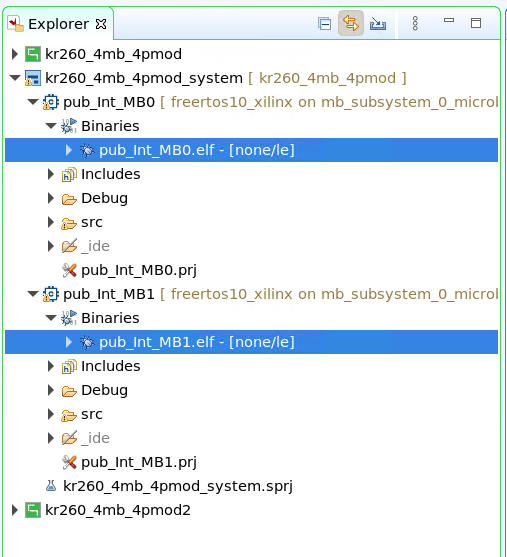
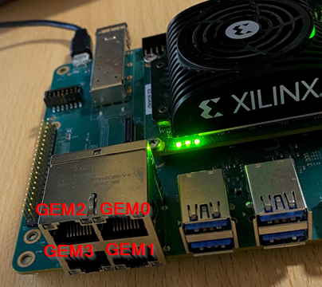
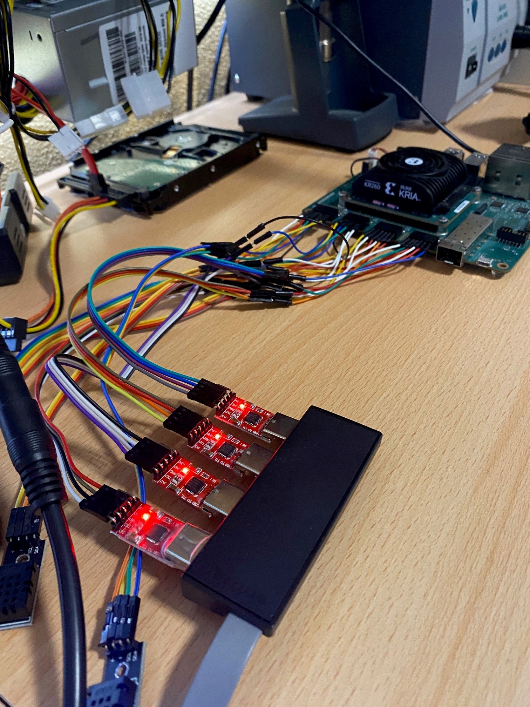
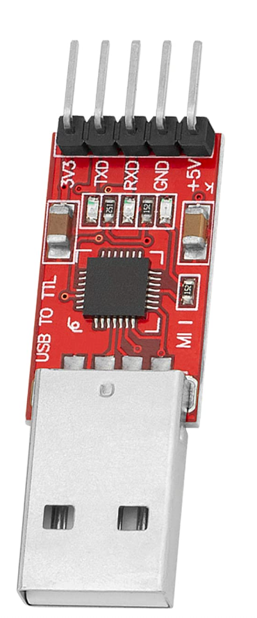

# **AMD Kria:tm: adaptable Robotics II – Unifying the communication protocol.**


docker run -it --rm --net=host microros/micro-ros-agent:humble udp4 -p 8888


## **Description**

In this example we will build and run Micro-ROS on two(2) of the MicroBlaze softcore CPUs. Micro-ROS will publish a message to an Agent running on a separate host, as seen in Figure #1 below. In this example we will continue to target the Kria KR260 board.


### **Platform Overview**

This tutorial builds on top of the other tutorial  [AMD Kria:tm: adaptable Robotics I – The right engine for the right task.](docs/Adaptable_Robotics_I.md).  
However, instead of printing to the PMOD, we will be running Micro-ROS client.

 
Following this tutorial, you should be able to put together a system containing the following -

* Ubuntu running on the A53 cluster

* MicroBlaze soft CPU's, running on demand in the FPGA fabric

* MicroBlaze controlled from Ubuntu via RemoteProc (start/stop/load)

* Micro-ROS running on MicroBlaze 

* R5 free to use


*Figure # 1 - A notional picture of the KR260 communicating to an external host. In this case, Micro-ROS running on MicroBlaze and communicating to an external host.*
<br>
<br>


This is what the final result should look like when you have gone through this tutorial.


https://media.gitenterprise.xilinx.com/user/485/files/d6115c1a-1813-43ac-8c87-86b11844771b


## **Building static Micro-ROS**


### **Description**:

The following information describes how to build static Micro-ROS images for the ARM Cortex R5 and the soft MicroBlaze CPU.

These instructions are based on eProsima's documentation, located here:

[micro-ROS for AMD Vitis](https://github.com/micro-ROS/micro_ros_vitis_component)

Follow the instructions in the link above to build the static Micro-ROS images for the ARM Cortex R5 and the soft MicroBlaze CPU.


### **Import Micro-ROS application for MicroBlaze**

The instructions above should result in static Micro-ROS libraries. Copy the static Micro-ROS files to the build system located here: *ros-dds-microblaze/KR260/example/MB/lib/microroslibs*

```
$ dir ros-dds-microblaze/KR260/example/MB/lib/microroslibs/
drwxr-xr-x 45 xde xde 5 14:45 include
-rw-r--r--  1 xde xde 5 14:45 libmicroros.a
```

Create and copy the Vivado **kr260_4mb_4pmod** project platform to the build system located here: (*ros-dds-microblaze/KR260/platforms/*) I.e.

```
$ cp -r (path)/kria-vitis-platforms/kr260/platforms/xilinx_kr260_4mb_4pmod_202210_1 (path)/ros-dds-microblaze/KR260/platforms/
```

```
$ dir ros-dds-microblaze/KR260/platforms/
drwxr-xr-x 4 tomast tomast 4096 Jan 16 09:56 xilinx_kr260_4mb_4pmod_202210_1
```

Build the Micro-ROS applications. (Make sure you have sourced Vitis version 2022.1)

```
cd ros-dds-microblaze/KR260/examples/MB/Adaptable_Robotics_II
make example
```
*NOTE - The above examples are built with a fixed IP address. If you want to change the IP address, you can do so by modifying the files in the src directory. 
The following is fixed:
MB0_MicroROS is set to "192.168.2.170", and MB1_MicroROS is set to "192.168.2.160, and they both communicate to the MicroROS agent at "192.168.2.114" and they both use the "192.168.2.1" for the gateway IP. Please modify these IP addresses to reflect your own network configuration.*


After building the applications, the result are two projects, one for MicroBlaze #0 and one for MicroBlaze #1. As can be seen in the picture below. 


Copy the two elf files to Ubuntu running on the KR260 board.

```
cp pub_Int_MB0.elf /lib/firmware
cp pub_Int_MB1.elf /lib/firmware
```

To start Vitis on the workspace created, type the following:
```
vitis --workspace ./vitis_kr260_MB_ws
```

#### **Run the Micro-ROS applications**

Finally we want to load and run the MicroBlaze code on the softcores. To do that follow these instructions.


Copy the files needed to the development board, if not already there.
(To get these files, the user will need to follow the example-print tutorial)

* FPGA binary file - kr260_4mb_4pmod.bit.bin
* MicroBlaze kernel driver *.ko file.(should be on the target already)
* MicroBlaze executable


On the board, do the following to load the remoteproc feature. (replace with your filenames should they be different)

```
fpgautil -b kr260_4mb_4pmod.bit.bin
insmod mb_kernel_driver.ko
```

Load the MicroBlaze application #0

```
cp pub_Int_MB0.elf /lib/firmware
echo pub_Int_MB0.elf > /sys/class/remoteproc/remoteproc1/firmware
```

Start and stop the MicroBlaze application

```
echo start > /sys/class/remoteproc/remoteproc1/state
echo stop > /sys/class/remoteproc/remoteproc1/state
```

Load the MicroBlaze application #1

```
cp pub_Int_MB1.elf /lib/firmware
echo pub_Int_MB1.elf > /sys/class/remoteproc/remoteproc2/firmware
```

Start and stop the MicroBlaze application

```
echo start > /sys/class/remoteproc/remoteproc2/state
echo stop > /sys/class/remoteproc/remoteproc2/state
```


In the end, this is what it should look like. Hope you made it this far! Thanks for trying this out, I hope it will help in your future endeavors.


https://media.gitenterprise.xilinx.com/user/485/files/fb0f58d9-c898-4475-aab5-a43534f3ffaf


<br>
<br>
<br>

### **Physical hardware information**


### PMOD 1 - 4 address map


### IO SWITCH


### GEM's SLOTS


### GEM's PHY SLOTS




### UART Connections example



### USB TO TTL example hardware

Connect RX and TX to the oposite on the PMOD.

```
USBTTL TX -> PMOD RX
USBTTL RX -> PMOD TX
USBTTL ground -> PMOD ground
USBTTL power 3.3v -> PMOD power 3.3v
```





